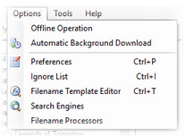
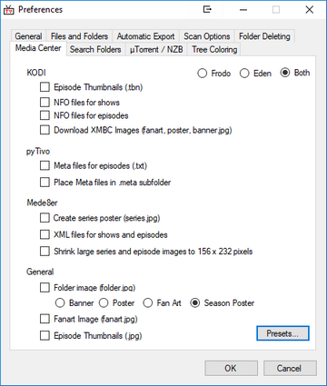
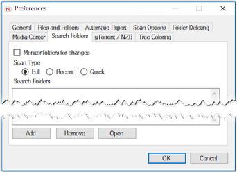
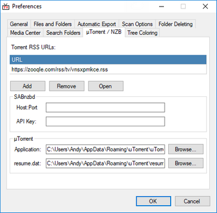
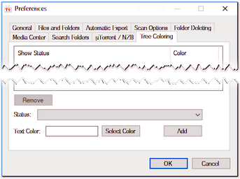
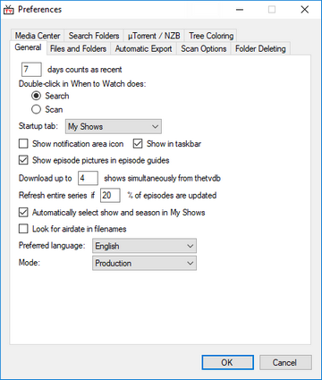
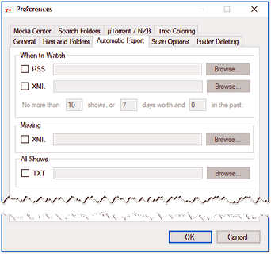
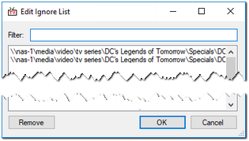
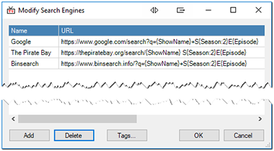
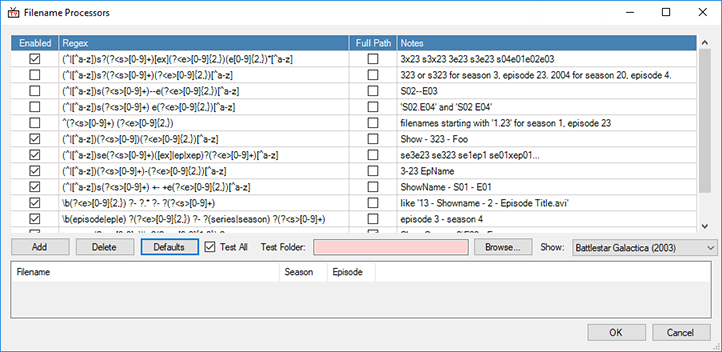

#### Options and Preferences

{:.pic-l}
One of TV Rename's strongest (and most confusing) features is its configurability. For the newcomer especially, it's very easy to get "lost" in the plethora of options and preferences, and give up.

Luckily the "out-of-the-box" defaults work well, and should you wish to change any settings, all the stuff you can "fiddle with" is described here.

As you can see from the image above there are a number of options, each of which is discussed below.

{:.center}
[Offline Operation](#offline-operation)&nbsp;&#9670;&nbsp;[Automatic Background Download](#automatic-background-download)&nbsp;&#9670;&nbsp;[Preferences](#preferences "Delve into the preferences")

{:.center}
[Ignore List](#ignore-list)&nbsp;&#9670;&nbsp;[Filename Template Editor](#filename-template-editor)&nbsp;&#9670;&nbsp;[Search Engines](#search-engines)&nbsp;&#9670;&nbsp;[Filename Processors]()

## Offline Operation

{:.toplink}
[Return to Top]()

## Automatic Background Download

{:.toplink}
[Return to Top]()

## Preferences

{:.pic-l}
The tabs in "Preferences", are each discussed below. 

{:.center}
[Media Center](#media-center)&nbsp;&#9670;&nbsp;[Search Folders](#search-folders)&nbsp;&#9670;&nbsp;[µTorrent / NZB](#µtorrent--nzb)&nbsp;&#9670;&nbsp;[Tree Coloring](#tree-coloring)

{:.center}
[General](#general)&nbsp;&#9670;&nbsp;[Files and Folders](#files-and-folders)&nbsp;&#9670;&nbsp;[Automatic Export](#automatic-export)&nbsp;&#9670;&nbsp;[Scan Options](#scan-options)&nbsp;&#9670;&nbsp;[Folder Deleting](#folder-deleting)

{:.toplink}
[Return to Top]()

### Media Center

This is were you tell TV Rename about your media player (and hence, the additional files you may need to download)

### AWAITING UPDATE

{:.toplink}
[Return to Preferences](#preferences)&nbsp;&#9670;&nbsp;[Return to Top]()

### Search Folders
{:.pic-l}
The ***Search Folders*** tab is used to tell TV Rename where to look for TV show episode files BEFORE they are processed. Logical entries in here would be your downloads folder (if you download TV show episodes from the internet) or maybe your desktop (if you rip TV show episodes from DVD or Blu-ray). Or both!

Three buttons are available at the bottom of the tab. `Add` opens an explorer style window so you can browse to the folder location you wish to add and click `OK`, `Remove` removes a highlighted row from the panel and `Open` opens an explorer window targeting the row highlighted in the panel.

At the top of the tab the "Monitor folders for changes" tick box tell TV Rename to automatically check for new files in the identified locations and the ["Scan Type"](userguide#scan-types) radio buttons tell TV Rename the type of scan to perform if anything is found.

| *Defaults:* | "Folder Monitor" | ***Un-ticked*** |
|-------------|------------------|-----------------|
|             | "Scan type"      | ***Full***      |

{:.toplink}
[Return to Preferences](#preferences)&nbsp;&#9670;&nbsp;[Return to Top]()

### µTorrent / NZB
{:.pic-l}
Some of the contents of this tab are use by the *Scan Options* tab.

"The Torrent RSS URLs:" can be any suitable RSS-feeds provided by indexers or public RSS websites and are used to  search for missing files.

`Add` and `Remove` allow you to add and remove feeds, and `Open` presents the highlighted feed in a web browser.

TV Rename can check both µTorrent and SABnzbd queues and uses some of the information provided on this tab to know where to look.

Both the "Host Port" and "API Key" are required to use this functionality in SABnzbd.
 
TV Rename also needs to know the µTorrent "Application" and "resume.dat" paths, (they can be found with the `Browse` buttons) so it can detect if files are in the process of being downloaded or are complete.
 
{:.toplink}
[Return to Preferences](#preferences)&nbsp;&#9670;&nbsp;[Return to Top]()

### Tree Coloring
{:.pic-l}
If you're like me and have a large catalogue of old TV Shows, the ***My&nbsp;Shows*** tab can be somewhat cluttered, but you don't want to remove anything from TV Rename. ***Tree Coloring*** to the rescue...

Tree coloring allows you to change the color of the text on the left hand pane of the ***My&nbsp;Shows*** tab depending on the status of the show or the show season.

To create a record:-
* Expand the "Status:" drop-down and select the status you wish to match from the list.
* Select a color to associate with the status by either entering a web-safe color name or code in the "Text Color:" box or clicking `Select Colour` and choosing from the pallet.
* Click the `Add` button and your new entry will appear the box above.

For example: to make finished shows less obtrusive in ***My&nbsp;Shows*** expand the "Status:" drop-down and select "Show Status: Ended", in the "Text Color:" box type "#808080" and click `Add`. Back in the  ***My&nbsp;Shows*** text for shows that have finished will be light grey and less obtrusive.

If you wish to remove a rule from the list just select it and click `Remove`.

{:.toplink}
[Return to Preferences](#preferences)&nbsp;&#9670;&nbsp;[Return to Top]()

### General
{:.pic-l}
*When to watch* "X" *days count as recent* 
Specifies how many recent days are listed for the for "Aired in the last N days" section of the ***[When to Watch](userguide#when-to-watch "Read about When to Watch")*** tab.

*Default: **7 days***

*Double-click in When to Watch does:* 
Controls the double-click action in the ***[When to Watch](userguide#when-to-watch "Read about When to Watch")*** tab. Options are Search and Scan.

*Default: **Search***

{:.clear}
*Startup Tab:* 
Selects which tab you wish open when TV Rename loads. ***My&nbsp;Shows***, ***Search*** or ***When to Watch***.

*Default: **My Shows***

The *Show Notification Area* and *Show in Taskbar* interact, one of them **must** be ticked. If you try to un-tick both the option you are changing clears, but the other one automatically sets.

If *Show in Taskbar* is selected TV Rename's icon appears in the Windows taskbar. 
If *Show Notification Area* is selected TV Rename's icon appears in the System Tray. Right-clicking it will show an "Upcoming Shows" list, and double clicking restores the main window. 
Both boxes can be ticked, in which case you get both functionalities.

| *Defaults:* | "Show Notification Area" | ***Un-ticked*** |
|-------------|--------------------------|-----------------|
|             | "Show in Taskbar"        | ***Ticked***    |

*Show episode pictures in episode guides* 
Does what-it-says-on-the-tin, if ticked screen grabs from show episodes are displayed with the episode description in the ***My&nbsp;Shows*** tab. If un-ticked only the episode description is displayed.

*Default: **Ticked***

*Download up to "X" shows simultaneously from TheTVDB* 
Sets the number of concurrent connections to TheTVDB API. It can be set in the range to 1 to 8.

*Default: **4***

*Automatically select show and season in My&nbsp;Shows* 
If ticked this works for both the ***When to watch*** and ***Scan*** tabs. If an item is selected in either of these tabs the ***My&nbsp;Shows*** tab is automatically updated to highlight the indicated show and season.

*Default: **Ticked***

*Look for airdate in filenames* 
If ticked this provides a second method of identifying show episodes by looking for a date (in a number of formats) in the shows filename and comparing that against the air-date.

The supported date formats are: "yyyy-MM-dd", "dd-MM-yyyy", "MM-dd-yyyy", "yy-MM-dd", "dd-MM-yy" and "MM-dd-yy"

And the "date separators" can be any of: - / . , " " (a space)

*Default: **Un-ticked***

*Prefered language:* 
This option sets the language for returned data when requesting information from TheTVDB API. TV Rename will request "English" If the selected language is not available.

{:.toplink}
[Return to Preferences](#preferences)&nbsp;&#9670;&nbsp;[Return to Top]()

### Files and Folders

{:.toplink}
[Return to Preferences](#preferences)&nbsp;&#9670;&nbsp;[Return to Top]()

### Automatic Export
{:.pic-l}
Ticking the "RSS" box in the "When to watch"  section of the panel will save a RSS-reader compatible XML file to the location you specify (by typing or browsing). This file can then be read by something like XBOX Media Center, or a Windows  RSS App.

Ticking the "XML" box in the "When to watch" section of the panel will save a standard XML file to the location you specify (by typing or browsing).

In either case you can limit how many days or shows are written to the file. The files are updated whenever the "When to watch" tab is manually or automatically refreshed.

Ticking the "XML" box in the "Missing" section of the panel will save a standard XML file containing the missing episodes detected during a scan to the location you specify (by typing or browsing)

Ticking the "TXT" box in the "All Shows" section of the panel will save a TXT file whenever a show is added, edited or deleted from TV Rename. It also gets updated when `Auto ID All` in the *Scan Results* tab of **Tools>Folder Monitor** is clicked.

*Default: **All un-ticked***

{:.toplink}
[Return to Preferences](#preferences)&nbsp;&#9670;&nbsp;[Return to Top]()

### Scan options

{:.toplink}
[Return to Preferences](#preferences)&nbsp;&#9670;&nbsp;[Return to Top]()

### Folder Deleting

{:.toplink}
[Return to Preferences](#preferences)&nbsp;&#9670;&nbsp;[Return to Top]()

## Ignore List
{:.pic-l}
When a ***Scan*** is run any "missing" episodes for shows in your "Media Library" are listed.

These may be genuine missing episodes or they may be "Specials", that don't fit the season/episode pattern but are still part of the show, for example: -

> My Favourite Show - S00E03 - Recap of Last Season

This may be something you want or it may just be adding to the "noise" in the ***Scan*** tab.

If it is "noise" you can highlight the row (or multiple rows if that fits better) and right click. A cut-down menu appears, if you select "Ignore Selected" the item is removed from the ***Scan*** results and appears in the "Ignore List".

If, at a later date, you decide you wish to add the item, you can remove it from the Ignore list using the *Edit Ignore List* window, selecting the item in question and clicking `Remove`.

{:.toplink}
[Return to Top]()

## Filename Template Editor
{:.pic-l}
This is where the format of the filenames that TV Rename will rename to are defined.

To help illustrate the results the "Sample and Test:" panel contains the processed entries from the show and season selected in the ***My Shows*** tab.

The "Naming template:" text box displays a tokenised version of the filename which can be edited directly or populated using the "Tags:" drop-down, or overwritten with a record selected from the "Presets:" drop-down. Any changes in the "Naming Template:" are automatically reflected in the "Sample and Test:" panel.   

The available tags with their definitions are listed below: -

|{ShowName}   |Name of the Show                                                         |
|-------------|-------------------------------------------------------------------------|
|{Season}     |Number of the season                                                     |
|-------------|-------------------------------------------------------------------------|
|{Season:2}   |Number of the season forced to 2 characters with a leading zero          |
|-------------|-------------------------------------------------------------------------|
|{Episode}    |Number of the episode (within a season), eg S01E03                       |
|-------------|-------------------------------------------------------------------------|
|{Episode2}   |Number of the second episode of a pair (within a season), eg S01E04-E05  |
|             | created by the default S{Season:2}E{Episode}[-E{Episode2}])             |
|-------------|-------------------------------------------------------------------------|
|{EpisodeName}|Name of the Episode                                                      |
|-------------|-------------------------------------------------------------------------|
|{Number}     |Overall number of the episode                                            |
|-------------|-------------------------------------------------------------------------|
|{Number:2}   |Overall number of the episode forced to 2 characters with a leading zero |
|-------------|-------------------------------------------------------------------------|
|{Number:3}   |Overall number of the episode forced to 3 characters with leading zero(s)|
|-------------|-------------------------------------------------------------------------|
|{ShortDate}  |Air date in short format, eg 25/12/2017                                  |
|-------------|-------------------------------------------------------------------------|
|{LongDate}   |Air date in lomg format, eg 25 December 2017                             |
|-------------|-------------------------------------------------------------------------|
|{YMDDate}    |Air date in YMD format, eg 2017/12/25                                    |
|-------------|-------------------------------------------------------------------------|
|{AllEpisodes}|All episodes - E01E02 etc                                                |

| *Default:* | ***{ShowName} - S{Season:2}E{Episode}[-E{Episode2}] - {EpisodeName}*** |
|------------|------------------------------------------------------------------------|
|            | (the second preset).                                                   |

{:.toplink}
[Return to Top]()

## Search Engines
 
The *Modify Search Engines* window controls TV Rename's outgoing interface with the world (other than TheTVDB). Here, you can configure how and where TV Rename points a web browser searching for files.

Using the `Add` and `Delete` buttons you can create or remove records at will, and the `Tags...` button will help you insert tags in the created URL. The tags supported are the same as for the previous item.

As an example, here is a URL entry for Google.

> https://www.google.co.uk/search?q={ShowName}+S{Season:2}E{Episode}

The list of URL's can be used when the ***When to watch*** tab is open, the last used entry becomes the default, and appears in a text box to the right of the `Refresh` button. It can be changed by clicking the `▼` button and selecting another entry.

With a little ingenuity you can get really creative with these entries and pass your search to its specific target through a web proxy.

{:.toplink}
[Return to Top]()

## Filename Processors
 
In much the same way that the ***Filename Template Editor*** is used to process the names of files being moved to the "Media Library" so ***Filename Processors*** is used to inform Rename what filenames to look out for when searching for a missing files

To really understand the contents of the Regex column above, you need a working knowledge of [Regular Expressions](https://regexone.com/ "Visit RegexOne").

Once you have figured out whats going on you can see that all the regular expressions capture the season and episode number of a show from the filename. Each one can work on just the filename: -

> ShowName S01E07.avi

or on the whole path: -

> C:/files/ShowName/S01E07.avi

Each expression can be toggled on and off, as can the ability to process a full path.

Each expression has a Notes field which can be used to remind the user why the expression was added.

Additionally, a folder can be specified to test the results of the Regular Expression.

In all likelihood you will find it unnecessary to make changes here, only if a new, totally unrecognisable file name structure appeared would it be necessary, and then there would probably be discussion about it in the forum.

{:.toplink}
[Return to Top]()

##### Files & Folders
| Field | Explanation |
|-------|-----------------|
| x | The filename character replacements set what to use if the episode name has a character in it that isn't allowed in a Windows filename. |
| x | "Find Extensions" sets the extensions of media files to look for. Separate them each with a semicolon, don't use spaces, and make sure you put the dot in! |

##### Media Centre
| Field | Explanation |
|-------|-----------------|
| x | y |

##### uTorrent / NZB
| Field | Explanation |
|-------|-----------------|
| x | y |

##### Coloring
| Field | Explanation |
|-------|-----------------|
| x | y |

"Use sequential number matching" will match episodes based on their overall airing order. Because this causes a lot of false matches, it is off by default. For example, Seinfeld S08E02 is the 136th episode aired, so with this option "Seinfeld - 136 - The Soul Mate.avi" will be seen at S08E02.

The "Default Naming Style" is what is used for new folders that you add, so if you are adding a lot, set it here first!

