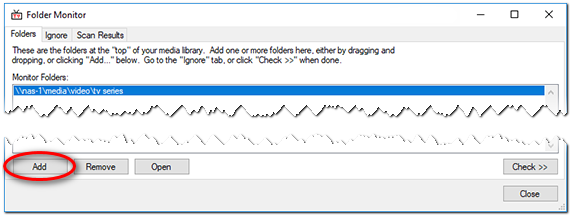

#### Tools
Here you can find tools to further manipulate your "Media Library".

## Folder Monitor

From here you can check your "Media Library" for new show folders unknown to TV Rename and quickly add them to the ***My Shows*** tab.

Before using this tool, check that your preferred renaming style is set in **Options>Filename Template Editor**.

`Add` (or Drag-and-Drop) folders to the ***Folders:*** tab. Click the `Check >>` button, and TV Rename will recursively search through the new folders looking for new tv shows. Once this is complete and if anything is found, the ***Scan Results*** tab will appear, populated with the paths to any newly found shows, it will also identify the folder structure of the show ("Flat" - everything in one folder or "Folder per season").

Click the `Auto ID All` button and TV Rename will try and identify the newly found shows using cached data from the TVDB. If the show is found the "Show" and "thetvdb code" colums will be populated. If a show isn't being matched or is being incorrectly identified highlight the row in question and use the `Edit` button to perform a manual search of the TVDB, and for a more in-depth interrogation you can use the `Visit TVDB` button which will launch a web browser targeting the shows page or `Open Folder` which will open the selected folder in Windows Explorer.

Clicking `Remove` will remove the highlighted row from the New Shows list, however it will be re-detected in the next run of "Auto ID All".

Clicking `Ignore` will add the folder to the "Ignore Folders:" list and it will be ignored is subsequent scans.

**** IGNORE LIST APPEARS TO BE BROKEN...

Click on a show to edit it. You can then type a tvdb.com code, or part of a show name, to find the tvdb.com code in the list. If it isn't showing up, type in part of the name and press the Search button. This searches on tvdb.com, and will add any results to the local code cache.

After entering the code, or clicking on the show in the list, enter (or correct) the season number. Changes are immediately applied to the "New shows and folders" list. If you select multiple folders, all will be updated simultaneously.

**Visit tvdb.com** will take you to the tvdb.com page, so you can check it is the right show. Guess will re-guess the show details.

Clicking Remove, or pressing delete on your keyboard will remove the selected folder(s) from the list. It will be re-detected the next tiem you do a Check here. Click Ignore to add the folder to the "Ignored Folders" list. Ignore All will ignore all folders in the list.

Open will open an Explorer window in that folder. Clicking on Done will then take all the shows with tvdb.com codes and season numbers, and add/merge them into your shows and folders lists.

In the example here, if the user clicked "Done" then only Seinfeld would be added. The other two shows are missing either the season number, or tvdb.com code.

## Exporters
"RSS Export" will save a RSS-reader compatible XML file to the location you specify. It can then be read by something like XBOX Media Center, or the Vista RSS Widget. You can limit how many days or shows are written to the file. The RSS file is updated whenever the "When to watch" tab is manually or automatically refreshed.

### AWAITING UPDATE

Below is an example of the RSS output being displayed in a Vista sidebar gadget. Clicking on each item shows the episode summary information.

### AWAITING UPDATE

## Actors Grid

### AWAITING UPDATE

## Statistics
Just how useful has TVRename been? "Episodes on disk" is the number of episodes found the last time a "missing check" was done. "Total Episodes" is the count from the tv.com episode guide for all the shows you have.

### AWAITING UPDATE

## Torrent Match
The "Torrent Match" tab lets you rename files, so their names match what is in a .torrent file. This is done using the torrent hashes, so it will work on any type of file, as long as it is big enough for a partial hash to be done on it.

Choose the .torrent file, and folder of files to rename. If you choose a "Copy To" location, the files will be copied to their new names, leaving the originals intact. If it is off, then they will be renamed in place. 

### AWAITING UPDATE

Currently, TVRename can only process single file torrents, and multi-file torrents without subfolders in them.

After clicking "Go", the torrent file will be processed. This can take a while if the torrent file has a lot of items in it, or there are a lot of potential matches in the "Folder" you have selected.

If processing is successful, you will be taken to the rename or finding and orgnising tab, to see the suggested operations. Your files will only be modified if you click "Rename" or "Move/Copy" from there.

### AWAITING UPDATE

It's not possible to rename the files in (a multiple file) torrent, to match what you have on disk. Changing the names affects the hash, which makes it a different torrent from the tracker's point of view. Because of this, TVRename renames the files on disk instead.
